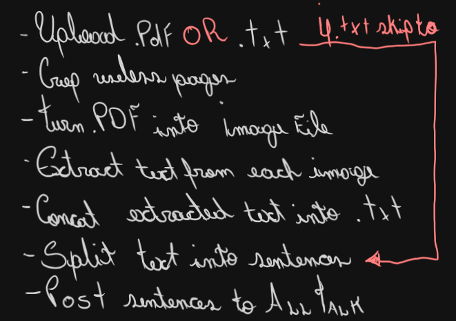

# ALLpdfcanTALK - WIP

This project was made to be used in conjunction with [alltalk_tts](https://github.com/erew123/alltalk_tts).  
It Allows the user to upload a PDF or a TXT file, crop the pages not needed (covers, illustrations, etc.) extract all text and send them as sentences to the alltalk_tts api.

